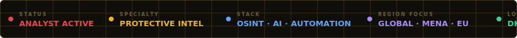

<!--
  DEPLOY: Upload all 5 files to the ROOT of Aureum01/Aureum01:
    README.md · hero.svg · ticker.svg · projects.svg · rule.svg
-->

 

 

 

 

&nbsp;

&nbsp;

 

---

## Background

Studied criminology in college with a minor in computer information systems. In turn, I became a subject matter expert in geopolitical behavior, international security, international relations, system development, criminology, and the social aspects of terrorism (both macro and micro). Upon graduation, I worked my way up as a security professional to a protective intelligence analyst for a security contracting company, where I've had the opportunity to work with crisis management and GSOC professionals. In high school, I graduated with a license in 911 dispatching and security given my focus on incident response and coordination. This is mirrored by my work ethic to always encourage others to be the dream of who they want to be, while doing the best they can.

---

## Technical Stack

Whatever is best for my project I will use, even if I have to take some time to read the documentation in depth before using it. The goal of my projects is to be the best solution to a problem or idea, and thus, it needs to be efficient.

**Systems**

**Automation**
- VBA Pipelines
- All-Source Data Collection
- System Development

**Research Interests**
- geopolitical forecasting
- intelligence automation
- AI-assisted analysis
- global risk monitoring
- behavioral intelligence
- reverse intelligence

**Writing**

I sometimes publish analytical pieces on global systems, geopolitics, and AI (or exposing a malicious system). I would also like to take some time to write horror stories again to retain my imagination.

---

## GitHub Activity

&nbsp;

 

 

 

*Building tools that help analysts detect signal within global noise.*

